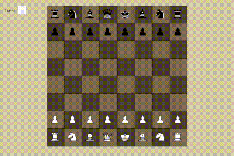

# Chess engine + UI -- C++ / raylib

Two-player Chess engine + UI buit with C++ and raylib.
<br>
<p align="center">
  
</p>

## 💡 Overview
Personal learning project focused on:
- Working with and organising modularized code
- Writing cleaner and more maintainable code

## 🎮 Controls
- **Left mouse button**: click and drag piece to move

## ✨ Features
- **Local 2-player** gameplay
- **Legal move highlighting**

## 📦 Setup (Linux)
### Requirements
- g++ (C++ compiler)
- raylib libraries

### Build & Run
```bash
chmod +x build.sh
./build.sh
./build/chess
```

## 🐛 Issues
- No check detection
- No an peasant
- No piece promotion
